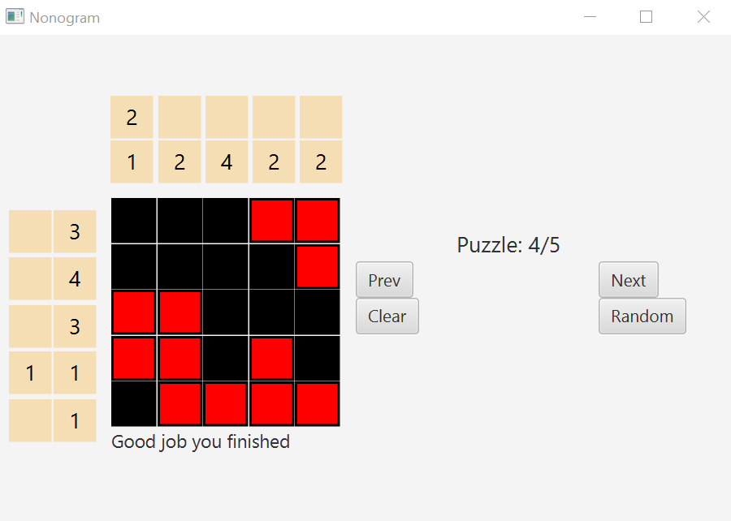

# Nonogram

A single player logic game involving using the row and column clue to lead to the desired pattern

This project uses the **model-view-controller** design pattern together with the **JavaFX** UI library to design a complete, functioning GUI.

## Installation

1. Clone the repo
2. Go to the App.java file and run the file and then play!

## Instructions

- Goal is to be able to get the desired pattern using the clues given
- If the user left-clicks on a cell, that cell becomes *shaded*. But, if they right-click on a cell, that cell becomes *eliminated*
- The top clues indicate the column clues (vertically solve)
- The left clues indicate the row clues (horizontally solve)

